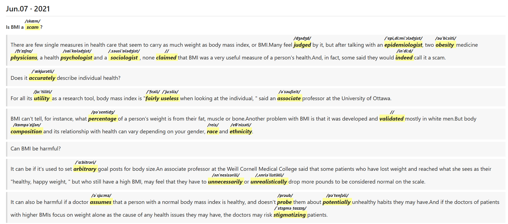

# EnglishRBB
英语阅读宝

# 技术栈
1. vue
2. django

# 感谢开源项目
[web-highlighter:网页高亮](https://github.com/alienzhou/web-highlighter)

[vue-markdown:markdown编辑器](https://github.com/zhaoxuhui1122/vue-markdown)

[ECDICT:英文->中文字典的双解词典数据库](https://github.com/skywind3000/ECDICT)

# 启动
0. python manage.py createsuperuser
1. python manage.py runserver 0.0.0.0:8888
2. cd frant
3. cnpm install
4. npm run serve


# 访问
```ini
127.0.0.1:8888/admin
```

# 已实现功能
1. 高亮单词显示音标
2. 翻译选中的单词
3. 单词游戏，填词和连线

# 简易使用方法
1. 点击左侧菜单英语阅读-->阅读材料
2. 点击增加，上传材料(PDF)
2. 点击开始阅读
3. 在markdown编辑器中整理文章格式
4. 阅读-选中单词实现高亮和显示音标
5. 浏览器打印为pdf(因为之后的编辑器操作会影响dom, 导致高亮失效)
6. 点击翻译-将每一个单词翻译结果追加到md文件中
7. 放到转换的在线工具(http://coolaf.com/tool/md)中-导出为pdf

# 效果图



# todo

[ ] 高亮还原

[ ] 内置markdown或者html转pdf

